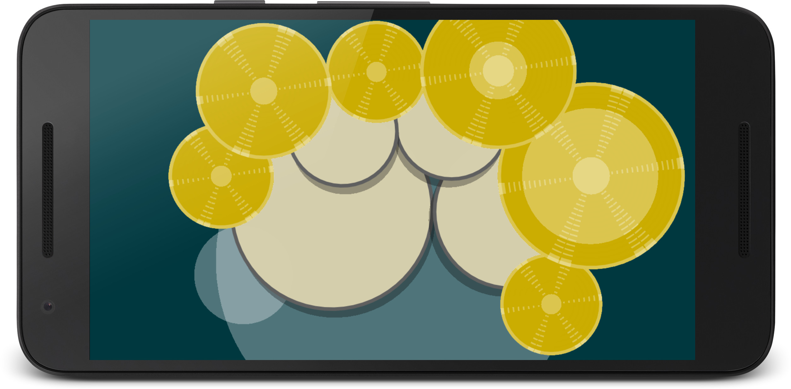

# Hexpress

[Hexpress app](https://play.google.com/store/apps/details?id=com.castlewrath.hexpress) on Google Play

Hexpress is a playground for constructing interactive musical experiments for use on Android devices. It's built on top of LÖVE framework. It is available as free-of-charge Android app and open-source project.




# Note layouts

Hexpress currently implements three note layouts: 

* hexagonal note layout
* fretboard arrangement
* free-form layout

Hexagonal layout (in hexpad module) is based on [Harmonic table note layout](https://en.wikipedia.org/wiki/Harmonic_table_note_layout). This arrangement has quite simple patterns for chords & arpeggios, and it was used historically as a method for music theory analysis and composition.

Fretboard is mostly modeled after guitar, but can also be used for other instruments. It supports any number of strings with customizable tuning. Compared to hexagonal layout, fretboard can be considered as generalized rectangle tiling, as strings and frets correspond to two axes of symmetry.

Free-form layout allows placing any number of circular zones that act as note triggers. It's meant to be used for percussive instruments.


# Design & architecture

Hexpress runs on Android & desktop versions of LÖVE framework. LÖVE is an *awesome* framework for 2D games, which also makes it decent fit for implementing virtual musical instruments.

LÖVE uses openal-soft library for cross-platform audio. It supports spatial audio, real-time effects (reverb, chorus, distortion, echo, flanger, modulator, compressor, equalizer), and sound capture. It's not meant for professional music applications, but so far it's proven to be effective for the needed scope. The released Hexpress app makes some modifications to LÖVE framework code. The framework code and Android building environment is currently not included in this repository because of maintainability problems. Please open an issue if this is of any interest.  

Hexpress supports any number of virtual instruments. Several instruments are provided in *patches* subdirectory. When application starts, a *selector* module scans for patches and presents them to user for selection. For this purpose, patch contains icon() function that is called each frame by selector to render representation of patch to user. Once a patch is selected, it starts executing in place of selector module.

Each frame, the input controls are read, processed and forwarded to patch. The patch can use a note layout module (hexpad, fretboard) to convert input touches to notes. Then this information can be manipulated to implement note bending, vibrato, chords/arpeggios or anything else. This manipulated information is sent to *sampler* module to convert to audio output. Sampler selects correct audio sample, adjusts its pitch to adapt it to desired note and tweaks its volume according to [ADSR envelope](https://en.wikipedia.org/wiki/Synthesizer#ADSR_envelope). Sampler is heavily customizable and controllable from Lua script. The patch acts like a mini-app and has full control over input, sound and rendering.

Aside from using built-in patches, Hexpress app can also open external project with different set of patches, or a completely changed codebase. Lua is interpreted language, so these changes don't require recompilation or app reinstallation. 


# Modifying instruments

[Seed patch]('patches/seed/seed.lua') is well-documented example of a patch, to serve as starting point for building custom instruments. Other option is to take most suited existing instrument and make desired modifications.

As mentioned, modified codebase doesn't require any compilation or building a new APK. The installed Hexpress app can load modified codebase instead of built-in codebase. This allows for tweaking setting, designing new insturments, modifying visuals, changing sound samples, all by modifying text files on your phone.

To see run modified version on your phone, copy content of whole project to internal device memory under directory /sdcard/hexpress, and launch the app. It will scan for project in this directory and run that instead of default project. It's good idea to change the background color in selector.lua, to be certain which version is currently running on device:  ```background = {l.rgba(0x003f20ff)}```

Please note: this feature will prevent you from seeing the updates in official app. To switch back to official project, just delete or rename hexpress directory in device memory.


# Unexplored ideas

Here are some promising ideas that I never got around to implementing.

An monophonic instrument that works in portrait mode, playable with single thumb. Sometimes you want to keep phone in the pocket and still make noise.

Capture sound with microphone, do on-the-fly harmonic analysis, and display the results as overlay on the hexagonal grid. This would enable strong feedback between outside performed music and the virtual instrument itself. One could whistle a melody and then play it flawlessly just by pressing the highlighted notes. 

Allow for scrolling of the underlaying musical grid and thereby extending the musical range of instrument. Being able to bring any note to screen center would also make it more useful for studying music theory.

Explore the musical theory concepts by implementing different note arrangements - Wicki-Hayden layout, circle-of-fifths, Janko piano layout and others.

An intelligent music assistant that automatically adds harmonic accompaniment to played melody, and suggests next melody note based on previous notes and learned model.

A layered looper that would enable whole compositions inside the app. The looper would record note events and repeat them periodically. The touch-to-sound latency could be measured and eliminated from looped playback. This looper could be combined with intelligent assistant - you would teach it to play something by repeating a pattern until it's well learned. The repetition in learning process would also serve to eliminate glitches/mistakes.
